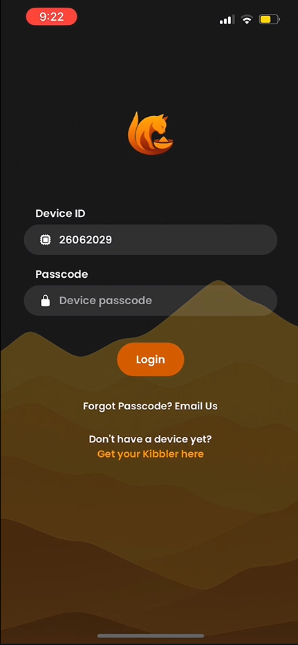
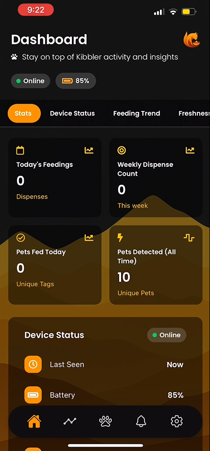
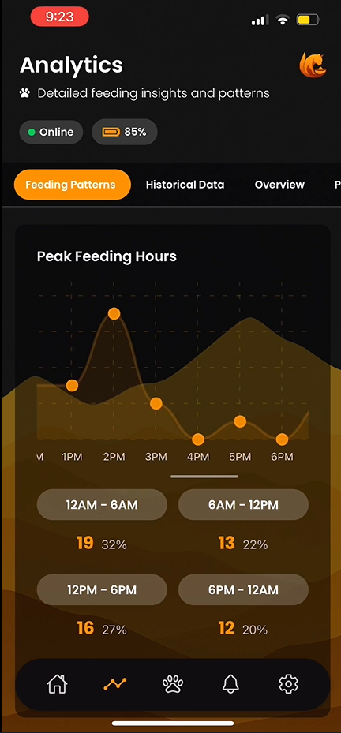
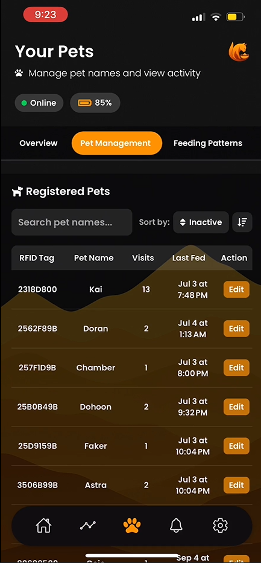
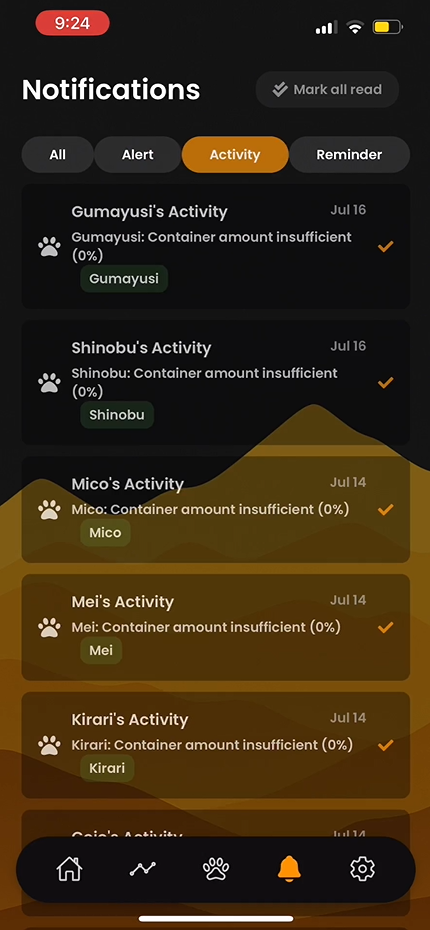
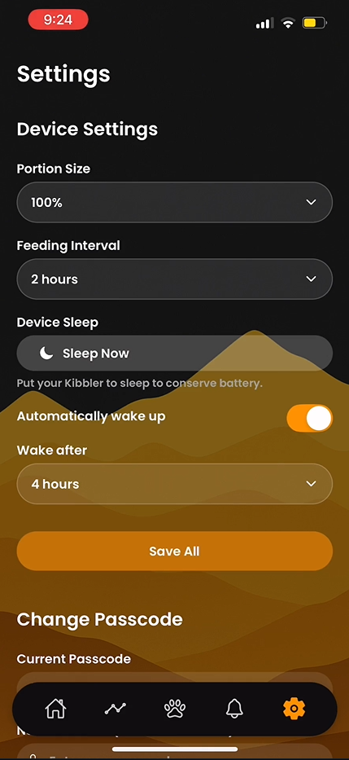

<div align="center">
	
	<h1>Kibbler Mobile App</h1>
	<p>Track, manage, and analyze your pet's feeding activities with Kibbler!</p>
</div>


<table>
	<tr>
		<td></td>
		<td></td>
		<td></td>
		<td></td>
		<td></td>
		<td></td>
	</tr>
</table>

---

## 📱 Overview
Kibbler is a mobile application designed to help pet owners monitor and manage their pets' daily activities, health, and notifications. Built with React Native and Expo, Kibbler offers a modern, user-friendly interface and insightful analytics to keep your furry friends happy and healthy.

## ✨ Features
- User authentication and secure login
- Dashboard with quick access to pet data
- Analytics for pet activities and health trends
- Notifications for important events
- Manage multiple pets
- Customizable settings

## 🚀 Getting Started

### Prerequisites
- [Node.js](https://nodejs.org/) (v16 or higher recommended)
- [Yarn](https://yarnpkg.com/) or npm
- [Expo CLI](https://docs.expo.dev/get-started/installation/)

### Installation
```bash
# Clone the repository
$ git clone https://github.com/Saimeown/kibbler-mobile-app.git
$ cd kibbler-mobile

# Install dependencies
$ yarn install
# or
$ npm install
```

### Running the App
```bash
# Start the Expo development server
$ npx expo start
```
Scan the QR code with the Expo Go app on your device, or run on an emulator/simulator.

## 📂 Folder Structure
```
app.json
App.tsx
assets/           # Images, icons, and fonts
components/       # Reusable UI components
config/           # Configuration files (e.g., Firebase)
hooks/            # Custom React hooks
app/              # App screens and navigation
readme-files/     # Screenshots for documentation
```

## 🖼️ Screenshots
| Login | Dashboard | Analytics | Notifications | Pets | Settings |
|-------|-----------|-----------|---------------|------|----------|
|  |  |  |  |  |  |

## 🛠️ Technologies Used
- React Native
- Expo
- TypeScript
- Firebase
- Custom Hooks

## 🤝 Contributing
Contributions are welcome! Please open an issue or submit a pull request for any improvements or bug fixes.

## 📄 License
This project is licensed under the MIT License.